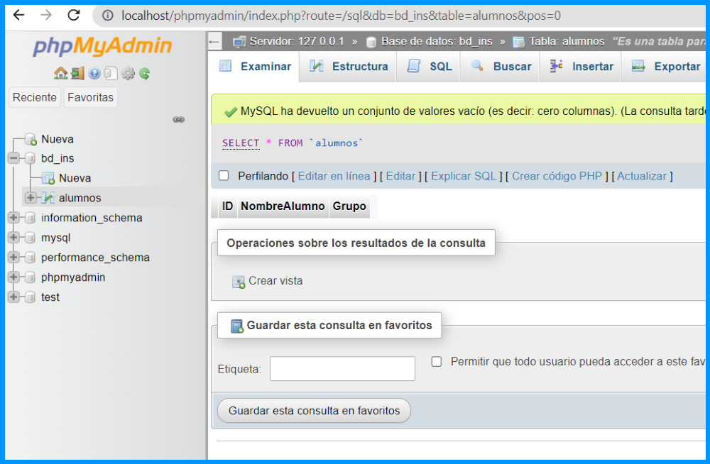
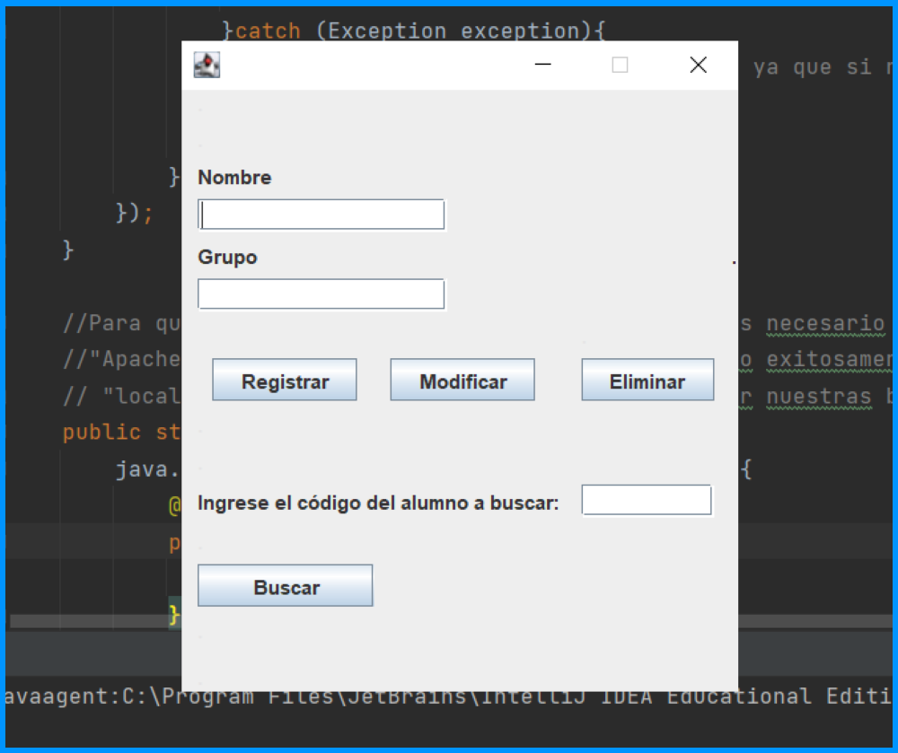
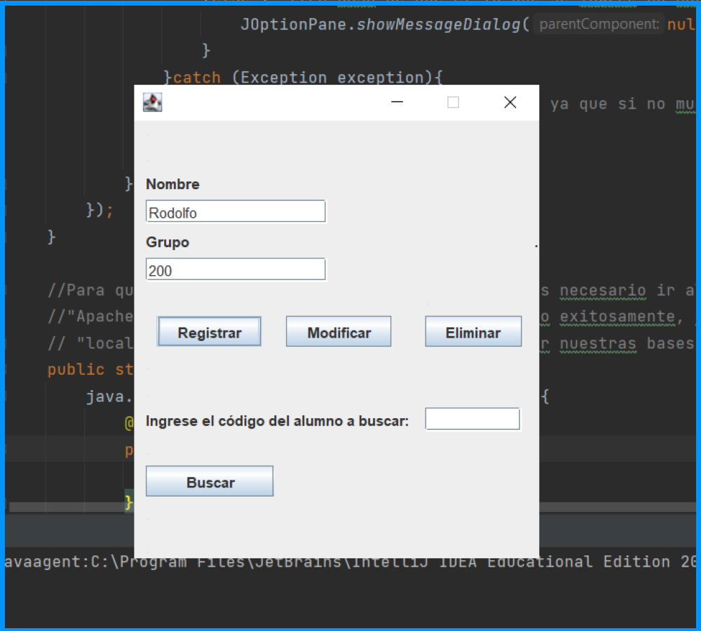
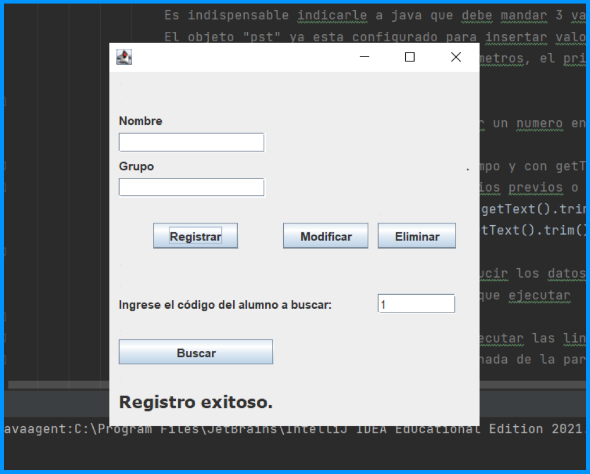
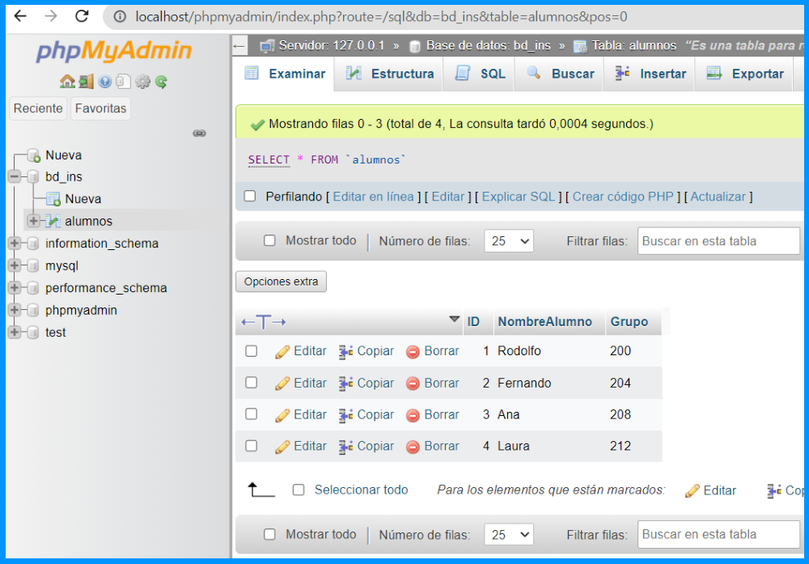
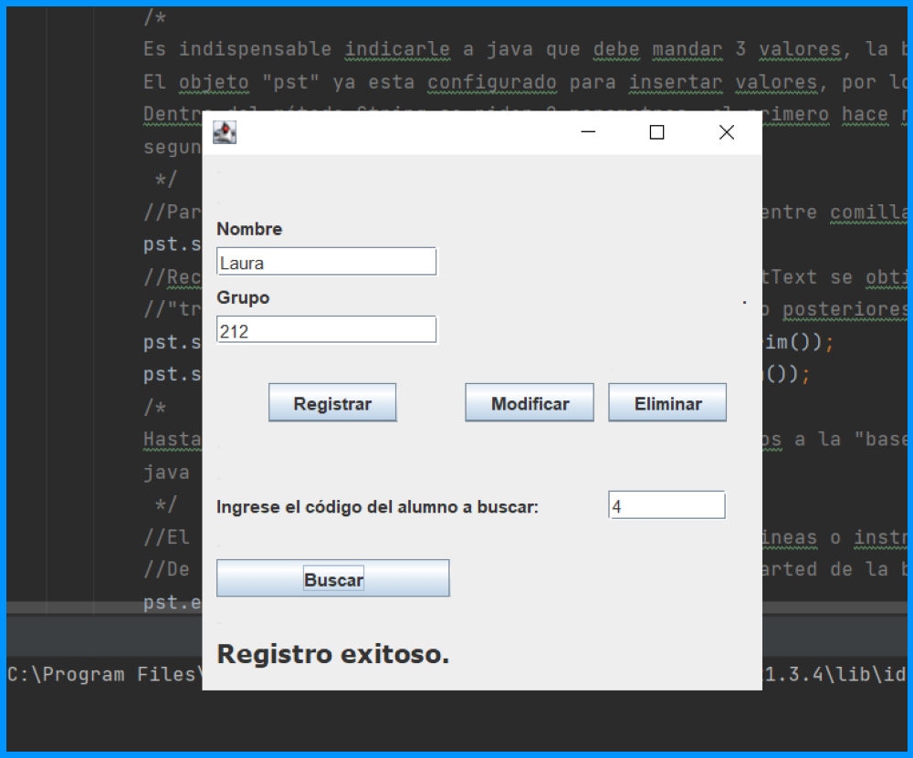
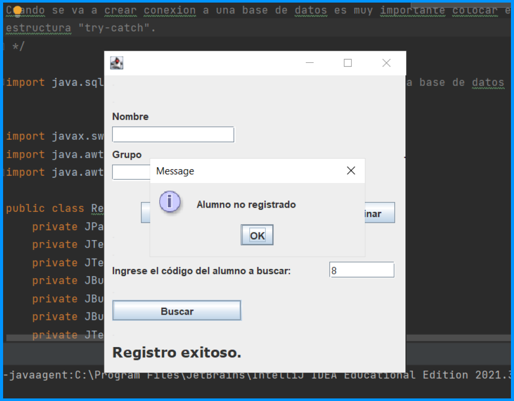

## Crear registro

- Primero verificamos desde el servidor local que creamos, que no hay ningun registro dentro de
nuestra base de datos.

- Corremos el programa desde java y aparecera la siguiente interfaz de usuario, donde se pueden
observar todas las funciones de un CRUD(Create, Read, Update y Delete).

- Para generar un primer regitro, procedemos a llenar los campos de Nombre y Grupo para despues
presionar el boton "Registrar".

- Despues de presionar el boton, los campos que se limpiaran pero en la parte inferior de la 
interfaz se puede observar una etiqueta con el mensaje "Registro exitoso". Repetiremos el mismo
proceso para registrar los alumnos que deseemos. 

- Para verificar que los alumnos se han registrado y almacenado en la base de datos, nos dirijimos
al servidor locar que se genero con XAMPP, lo actualizaremos y observamos que efectivamente se han
generado los registros.

## Consultar registro

- Para realizar una consulta para algun registro almacenado en la base de datos, primero se ingresa
  el código(ID) del alumno en el campo de texto "buscar", despues se presiona el boton "Buscar".

- En caso de que se consulte un registro que no exista en la base de datos, mandara el siguiente
mensaje: 

