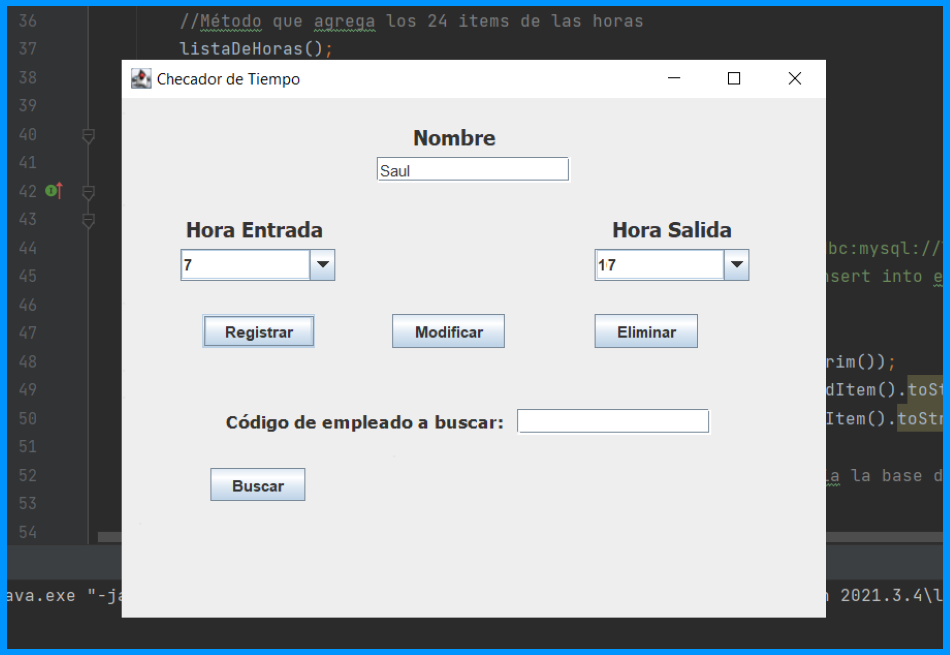
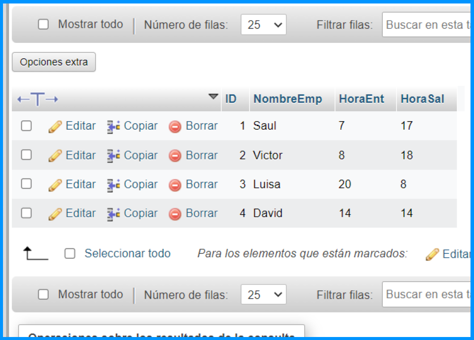
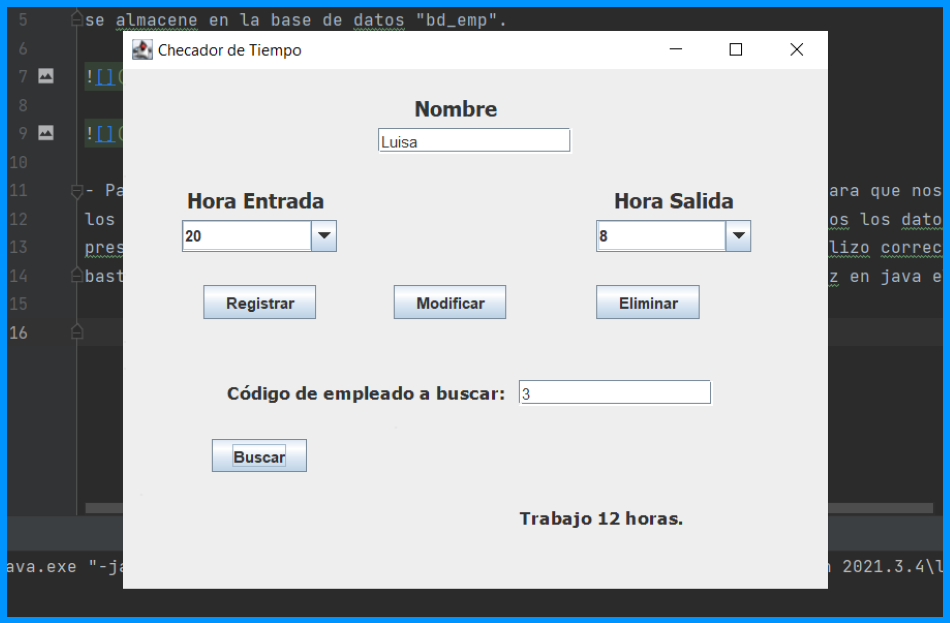
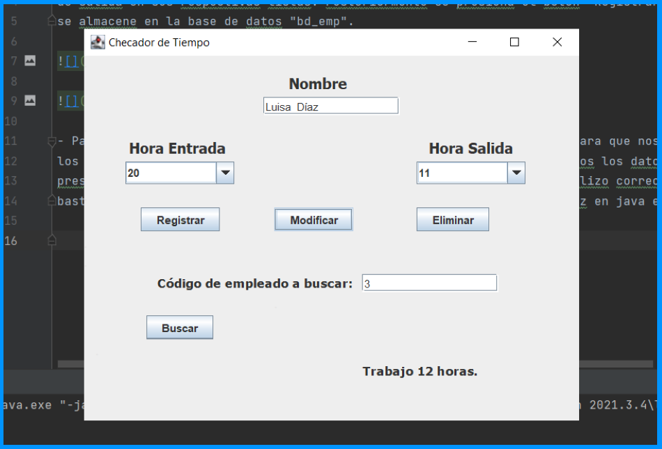
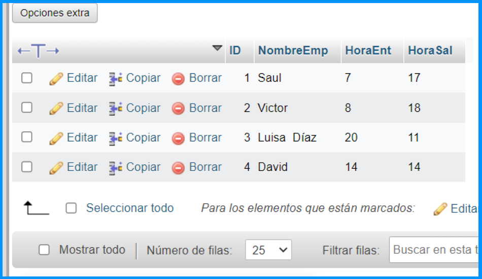
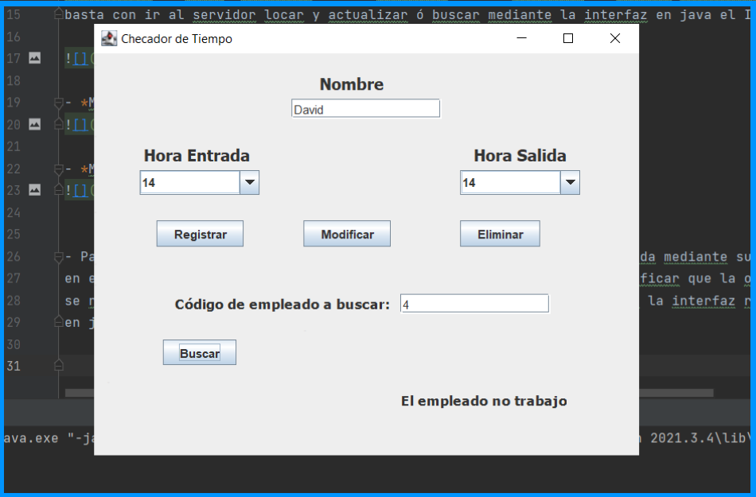
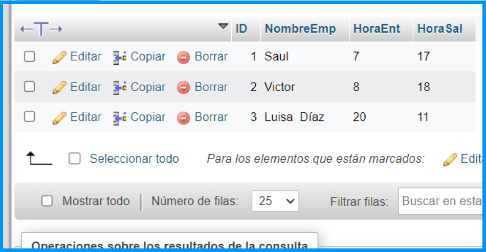
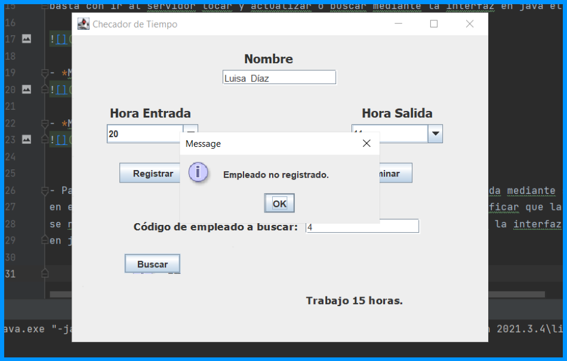

# Checador de horas para empleados (CRUD)

## Crear registro
- Se ingresa el nombre de empleado, se selecciona la hora de entrada  y la hora
de salida en sus respectivas listas. Posteriormente se presiona el boton "Registrar" para que
se almacene en la base de datos "bd_emp".

- *Se crea y envia el registro del empleado*

## Leer y Modificar registro
- Para realizar una modificación se ingresa el ID en el campo "buscar" para que nos muestre
los datos y podamos leerlos y ver que cambios necesitamos hacer. Ya listos los datos, solo 
presionamos el boton "Modificar", para verificar que la operación se realizo correctamente,
basta con ir al servidor locar y actualizar ó buscar mediante la interfaz en java el ID.

- *Modificacion en interfaz*

- *Modificación exitosa en la base de datos*

## Eliminar registro

- Para eliminar el registro de un empleado, primero generamos una busqueda mediante su ID
en el campo "buscar", despues presionamos el boton "Eliminar". Para verificar que la operación
se realizo con exito nos dirigimos al servidor local o buscamos mediante la interfaz realizada
en java con el ID.

- *Busqueda de registro a eliminar*

- *Verificación en base de datos la eliminación de registro*

- *Busqueda de registro eliminado en interfaz*
