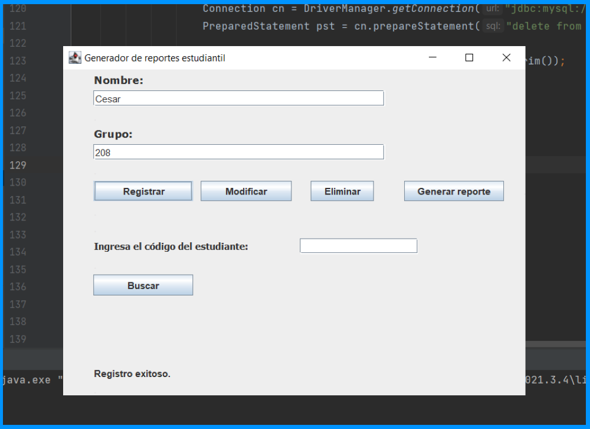
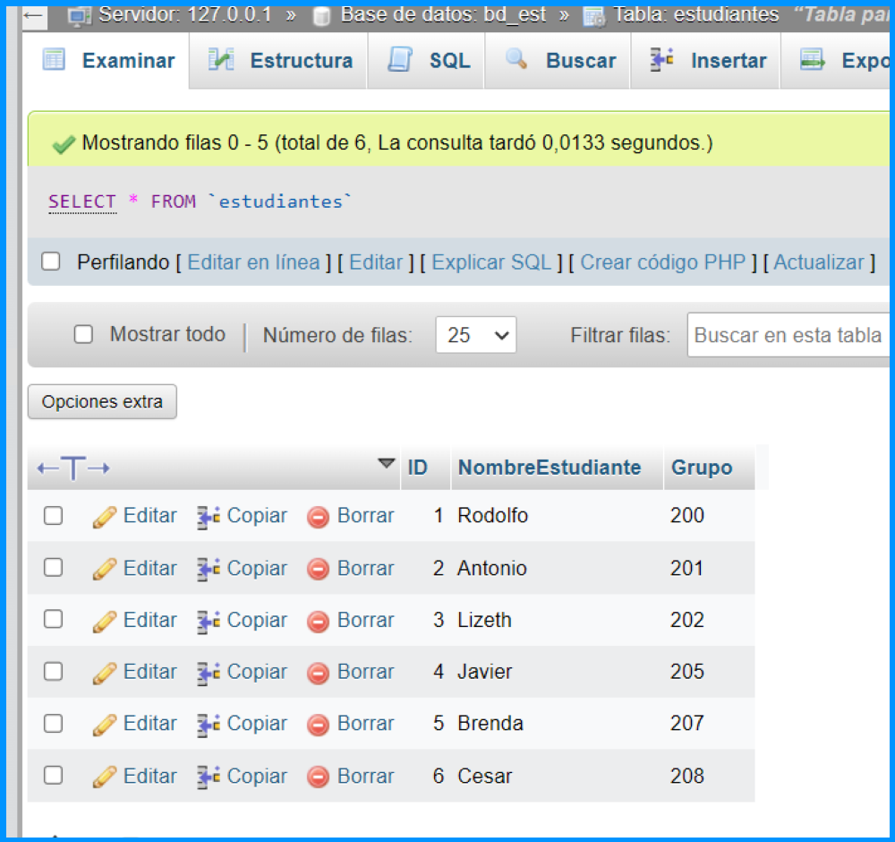
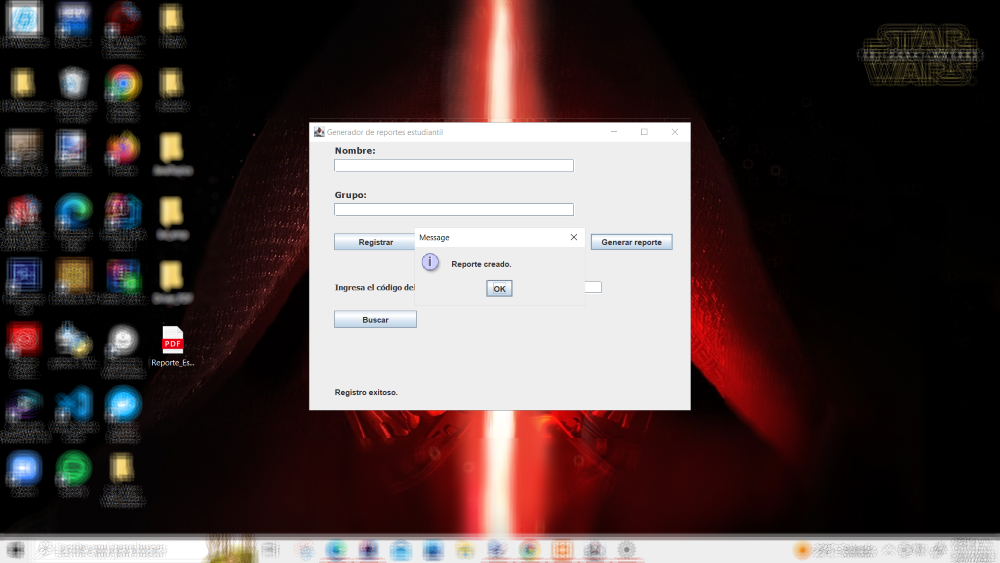
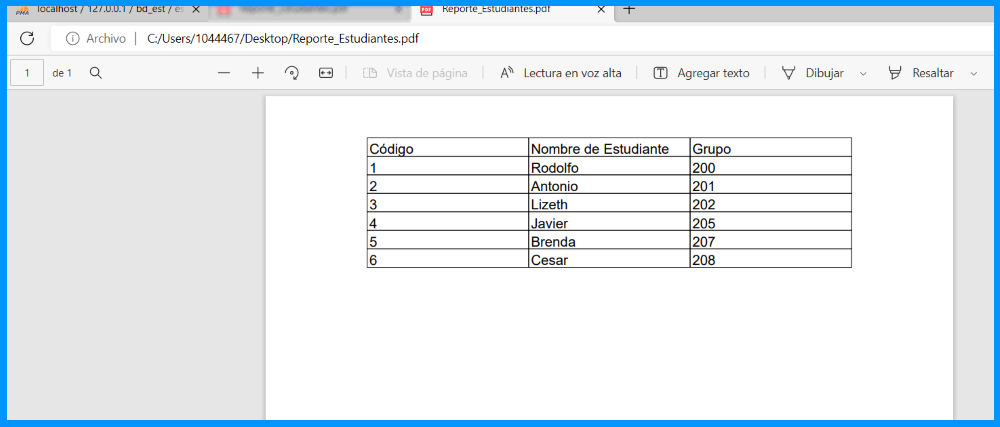

# Librería "ITEXT"

Es una librería de código abierto la cual nos va a permitir generar y manipular archivos en formato PDF
a través de java.

**Importante:** Aunque ITEXT es de código abierto, no significa que sea gratuito, es decír, si
se crean proyectos para comercializar u obtener ingresos, ITEXT pide que se adquiera una licencia,
de lo contrario, si el proyecto es gratuito o de código abierto, se puede utilizar la versión gratuita.

[Link de descarga | Version itext5-5.5.12](https://mega.nz/file/lJozxCDb#siW6qarBVy8etqnBTIEkC8fCqkgsOAcu4gysK41GFNc)

## Instalación y configuración de controlador(conector)

Antes de comenzar el proyecto es necesario descargar el driver con la verisión itext5-5.5.12. Una vez
descargado, realizar los siguientes pasos para instalar adecuadamente:
- Dar doble click en el archivo de tipo WinRar que se descargo, para que nos muestre su contenido.
- Buscar el archivo "itext5-itextpdf-5.5.12.jar" y lo arratramos fuera de la ventana.
- Copiamos el archivo y lo pegamos en la carpeta donde esta nuestro proyecto, al igual que con driver-connector.
- Ahora nos dirigimos a nuestro proyecto dentro de Intellij y seleccionamos la carpeta que acabamos de agregar.
- Dar click derecho sobre ella y seleccionamos la opción "Add as a library".

Ahora todo esta listo para comenzar a crear la interfaz desde java e implementar la librería.

## Crear reporte de los registros de estudiantes en un archivo PDF

En la carpeta "BD_Alumnos" ya se ha explicado como crear, leer, modificar y eliminar un
registro desde la interfaz diseñada en java, al igual que verificar los registros en la 
base de datos desde el servidor local y en la propia interfaz de usuario.

Para este programa se utiliza el mismo diseño de interfaz, unicamente se agrega un botón 
para generar un reporte en archivo de tipo PDF. El cual funciona de la siguiente manera:

- Primero se generan los registros necesarios desde la interfaz y se almacenan en la base de datos.

- Se verifican que los datos esten escritos correctamente y en caso de que exita un error de 
escritura, dato o valor, se realiza una modificación.

- En caso de tener algun registro que no necesitamos, simplemente se elimina.

- Cuando ya se tienen todos los registros listos, solo presionamos el botón "Generar reporte",
el cual nos crea un archivo llamado "Reporte_Estudiantes.pdf" en el escritorio. Este reporte
contiene todos los regitros ordenados dentro de una tabla con las 3 columnas que separan, os 
3 tipos de datos que se requieren para registrar un estudiante(ID, NombreEstudiante, Grupo).

