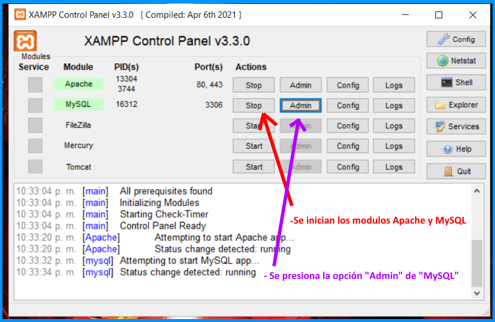
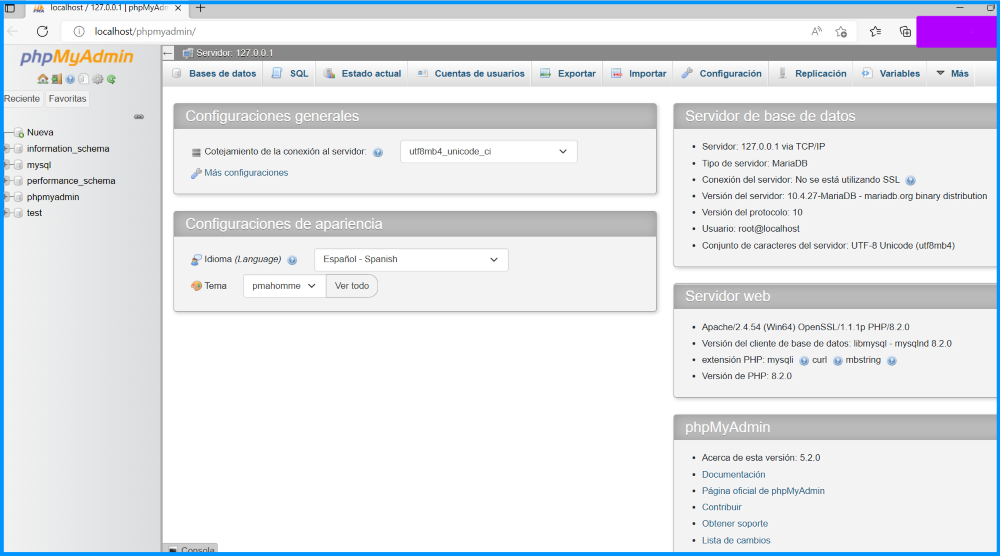
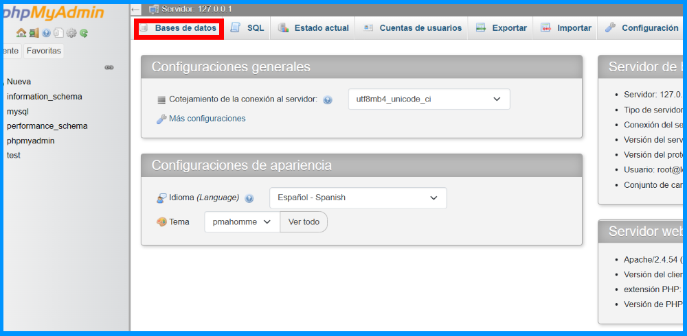
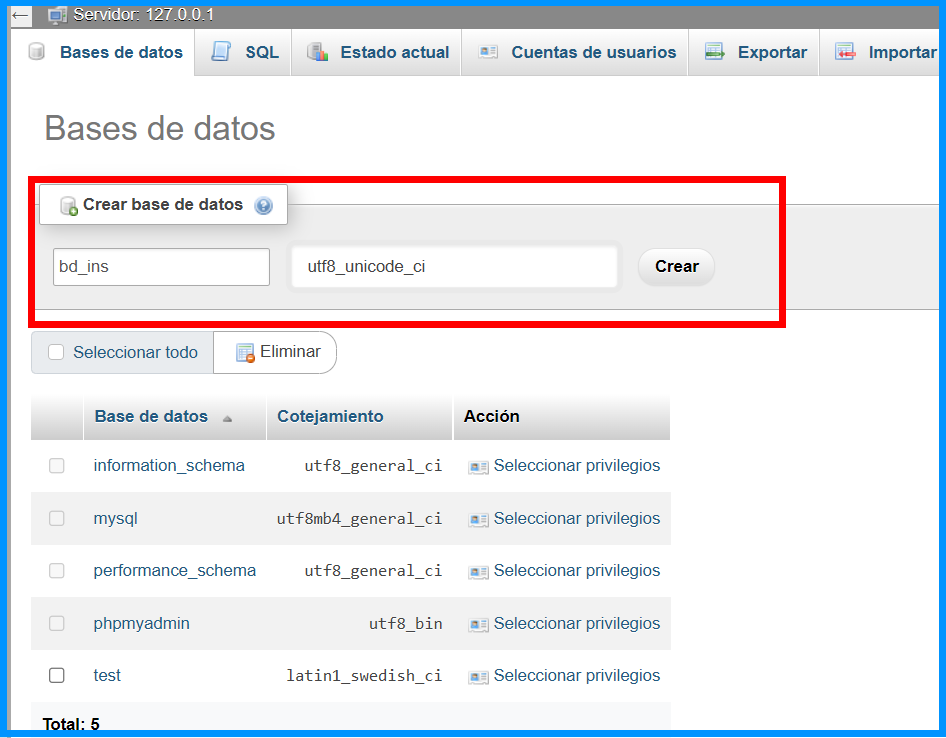
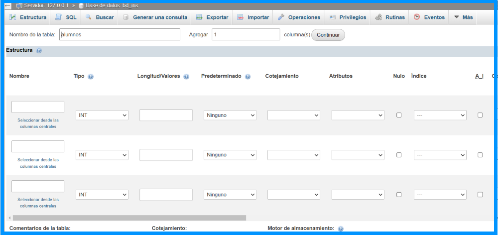
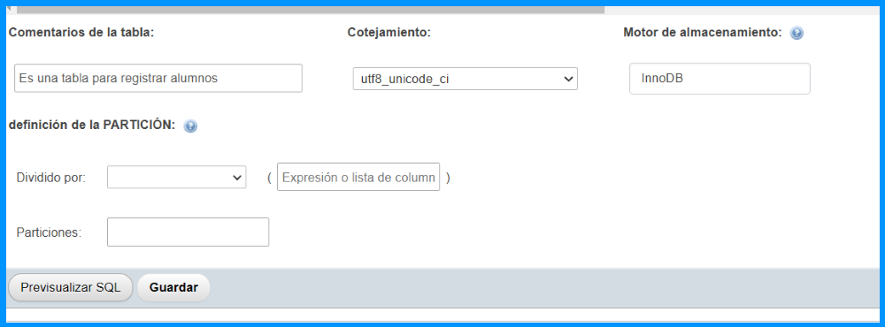
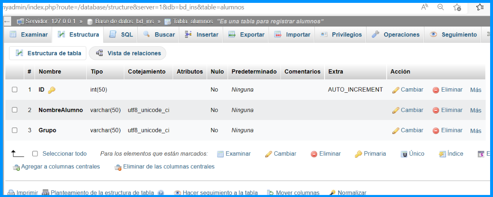

# Base de Datos

Una base de datos, es una colección de datos almacenados de forma organizada con una lógica coherente.
Las bases de datos permiten compartir estos datos entre distintos usuarios y programas, con lo cual se
facilita el intercambio y consulta de información sin importar la ubicación geográfica.

En una base de datos, las entidades y atributos del mundo real, se convierten en registros y campos.
Estas entidades pueden ser tanto objetos materiales como libros o fotografías, pero tambien personas e,
incluso, conceptos o ideas abstractas.

## Instalación y configuración de controlador(conector)

Antes de comenzar el proyecto es necesario descargar un driver o controlador que MySQL pone a disposicion
para poder establecer una conexión con sus bases de datos, se trabajara con la versión 5.1.46 ya que contiene
lo necesario para este proyecto.

[Link de descarga](https://mega.nz/file/oNg1iS6S#9ZHqcUZWffy8RiLmBPpS-R3hiLp-U7RugiE6dcr3S2c)

Una vez concluida la descarga:
- Descomprimir el archivo.
- Ingresar a la carpeta obtenida, en la cual se podran observar 2 archivos de tipo "jar", pero se selecciona
  el que no termina en "bin" y se copia.
- Posteriormente se creara un nuevo proyecto en el IDE de nuestra preferencia, al cual llamaremos
  "BD_Alumnos" y dentro agregaremos un paquete llamado "Ventanas", en el cual se creara un JFrame Form con el
  nombre de "RegistroAlumnos".
- Ahora nos dirijimos a la ruta donde se encuentra la carpeta del proyecto desde los documentos de nuestra
  PC, en mi caso "IdeaProjects" y despues ingreso a "CursoJava".
- Se creara una carpeta con el nombre de "driver-conector" y dentro se pegara el archivo jar,
  "mysql-connector-java-5.1.46", que se descargo para establecer conexión con las bases de datos. Se hara esto
  para tenerlo siempre a la mano en el paquete en el que se esta agregando.

- Despues regresaremos al IDE con el que estamos trabajando para agregar el driver a nuestro proyecto, por
  lo que daremos click derecho en la carpeta "driver-conector" y seleccionaremos la opción "Add as Library",
  para pasar a diseñar el panel de Altas y consultas.

## ¿Que es XAMPP?

Es un paquete de software libre que consiste principalmente en el sistema de gestion de base de datos
"MySQL", ademas provee algunas otras herramientas como, un servidor web "Apache" y los interpretes para
lenguajes de programación, como lo son, "PHP" y "Perl". La gran ventaja de trabajar con XAMPP es, que es una
distribucíón de apache completamente gratuita, lo que quiere decir, es que no se necesita comprar
ninguna licencia para poder utilizarlo. La otra gran ventaja es que cuenta con sistema de gestión de base
de datos en MySQL, y MySQL tambien es un software libre que no requiere que se compre ningun tipo de
licencia.

Permite montar un servidor local en nuestra PC, de esta manera podremos crear y gestionar bases de datos
que mas adelante concectaremos con nuestros desarrollos en java.

## Configuración XAMPP

- Presionar "start" en los modulos de "Apache" y "MySQL" en el panel de control inicial.

- Abrira una página donde esta el host de la base de datos que se creara, conocido como "localhost".
  Quiere decir que ya estamos dentro del servidor local que acabamos de instalar, por lo que ya se puede
  comenzar a crear y gestionar bases de datos para posteriormente conectarlas con Java.

## Creación de Base de Datos en XAMPP

- Se selecciona la opción "Base de Datos".

- Dentro del apartado "Base de Datos", tendremos al inicio 2 campos de texto, en el primero se inidica
  el nombre que tendra la "bd", y en el segundo se indica el tipo de cotejamiento, es decír, el tipo de
  caracteres que se van a utilizar, por ejemplo se suelen usar acentos, pero si no se utiliza la opción
  "utf8_unicode_ci" se mostraran simbolos extraños en su lugar.

- Se dara click en crear.

- Ya creada la base de datos, ahora se debe de crear una tabla, a la cual nombraremos "alumnos" y posteriormente
  indicar el "Número de columnas" que se utilizaran, es decír, el número de campos que va a tener la tabla.
  En este caso, usaremos 3 ya que se colocara un número de identificación(id), nombre y grupo al que pertenece.

- Dar click en "Continuar".

- Se puede observar los apartados que se deben de llenar para las 3 columnas que previamente reservamos.

- Se llenara la tabla, explicación con columna ID:
  -Nombre: ID
  -Tipo: INT(Entero)
  -Longitud/Valores: 50(El numéro como maximo puede tener 50 digitos)
  -Cotejamiento: utf8_unicode_ci
  -Indice: Solo para el identificador "ID" se asigna el "primary key"(Llave primaria que permite relacionar tablas entre sí)
  -A_I: Seleccionar como marcado(Hace referencia a que cada que entre un nuevo registro, se auto-incrementa el ID)
  -Los campos no mencionados se pueden dejar como estan predeterminados.

- Por lo regular cuando se trabaja con nombres como variable, se utiliza el tipo "VARCHAR" ya que va de una long. de 0 a 65.

- El "Comentario de tabla" generalmente se escribe para otro programador que vaya a trabajar con ella.
- El cotejamiento se utiliza el mismo que el de las columnas y el motor de almacenamiento se deja configurado como esta.
- Dar click en "Guardar".

- Se tienen listos los 3 campos de la tabla, por lo que ya se puede iniciar a ingresar valores en la base de datos,
  mediante la conección de los programas desarrollados en Java.

