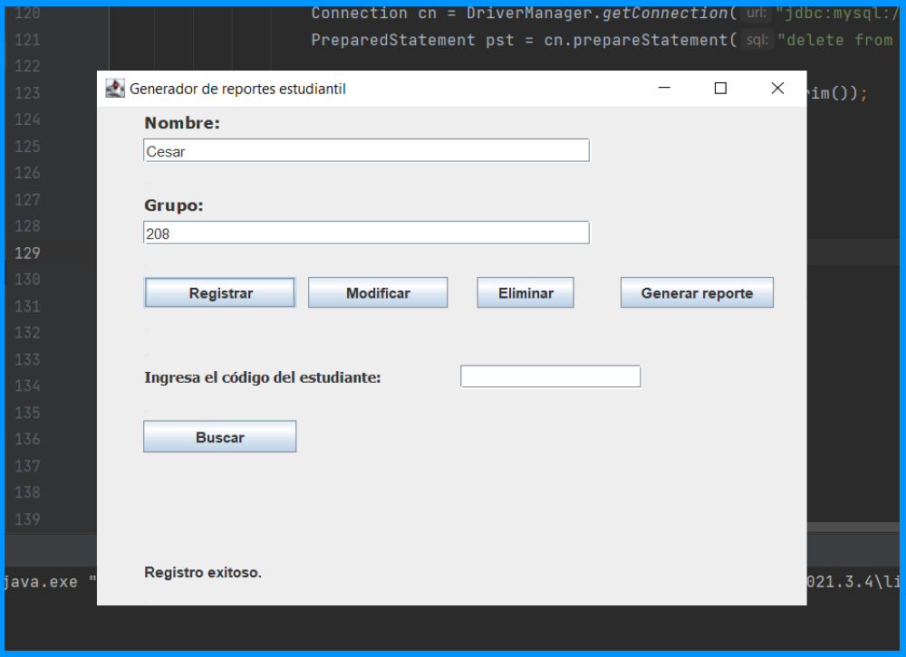
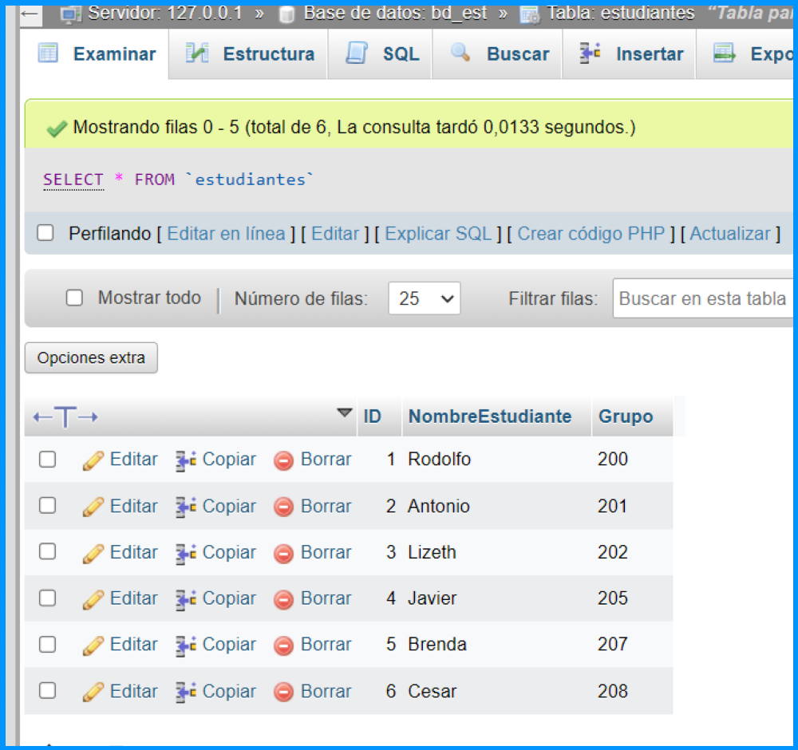
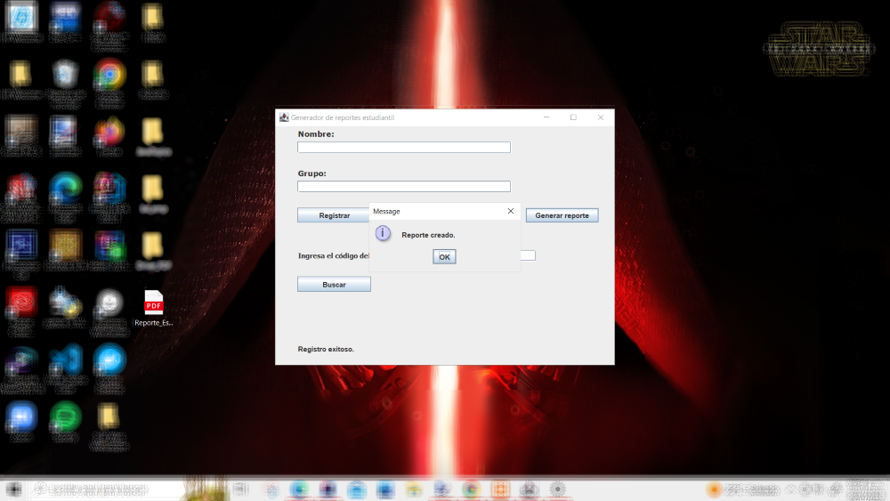

# Crear reporte de los registros de alumnos en un archivo PDF

En la carpeta "BD_Alumnos" ya se ha explicado como crear, leer, modificar y eliminar un 
registro desde la interfaz diseñada en java, al igual que verificar los registros en la
base de datos desde el servidor local y en la propia interfaz de usuario.

Para este programa se utiliza el mismo diseño de interfaz, unicamente se agrega un botón 
para generar un reporte en archivo de tipo PDF. El cual funciona de la siguiente manera:

- Primero se generan los registros necesarios desde la interfaz y se almacenan en la base de datos.

- Se verifican que los datos esten escritos correctamente y en caso de que exita un error
de escritura, dato o valor, se realiza una modificación.

- En caso de tener algun registro que no necesitamos, simplemente se elimina.

- Cuando ya se tienen todos los registros listos, solo presionamos el botón "Generar reporte", 
el cual nos crea un archivo llamado "Reporte_Estudiantes.pdf" en el escritorio. Este reporte
contiene todos los regitros ordenados dentro de una tabla con las 3 columnas que separan 
los 3 tipos de datos que se requieren para registrar un estudiante(ID, NombreEstudiante, Grupo).

